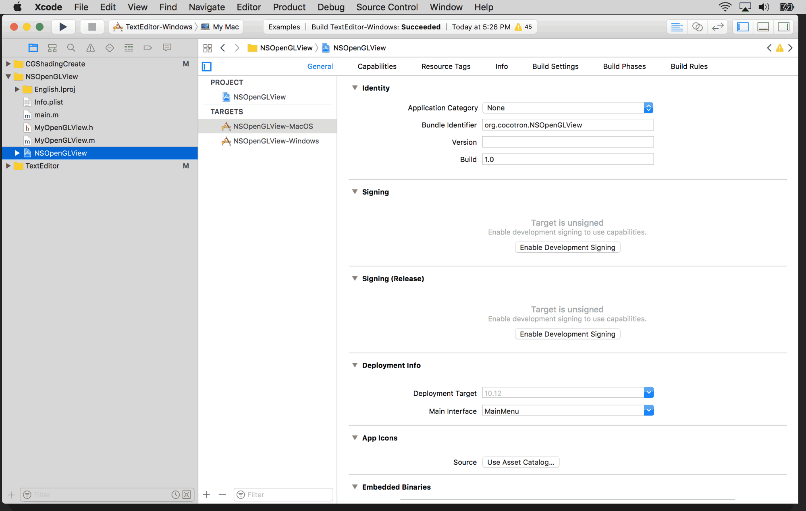
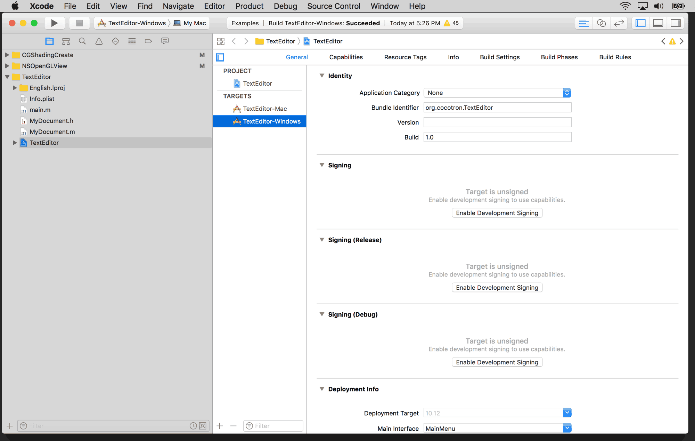

# cocotron-sierra
💡 **Before you clone or build:**  
Make sure you have Git LFS installed — you’ll need it to pull down the binary in `./Developer/cocotron-sierra.pkg`.

👉 Get it here: https://github.com/git-lfs/git-lfs/wiki/Installation

If that isn't working for you, review earlier commits at this line number.

---

GERHARD'S README -> README.txt

---

## Overview

This repository is a **modified fork of Cocotron** tailored for **macOS Sierra** and tested with **Xcode 8.2.1**. It includes support for Git LFS and provides a prebuilt macOS installer package.

The goal is to make Cocotron **easy to install and ready for development** without extensive manual setup.

---

## What This Is

- A Cocotron master clone modified to work well on **OS X Sierra**.
- Tested with **Xcode 8.2.1** and later environments on macOS.
- Includes an installer package so you can start developing **without running install shell scripts**.

---

## Git LFS

This repository contains a **binary installer package** tracked with **Git Large File Storage**:

